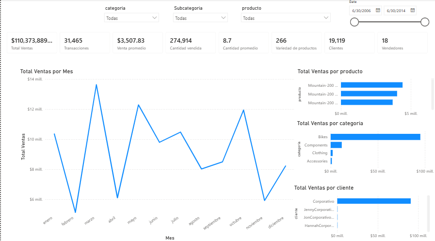
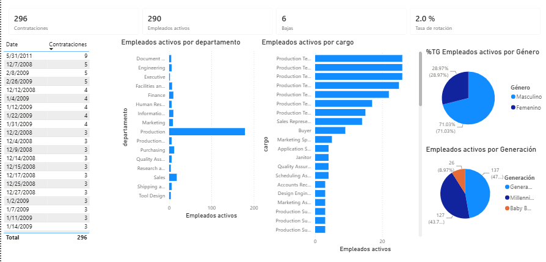

# Reporte-Gestion-Comercial-AdventureWorks
Datos de la base AdventureWorks, extraídos con SQL Server y consultas propias, visualizados en Power BI

## Objetivo
Monitorear ventas, compras y RRHH de forma centralizada 
para la toma de decisiones

## Herramientas utilizadas
- SQL Server (consultas de extracción y transformación)
- Power BI Desktop (modelado y visualización)
- DAX (medidas calculadas)

## Estructura del reporte
- **Ventas**: KPIs de ventas totales, transacciones, ranking por 
producto/categoría/cliente.
- **Compras**: seguimiento de órdenes de compra, OTIF, tiempos de recepción.
- **RRHH**: dotación, contrataciones, bajas, distribución por 
departamento/género/generación.

## Consultas SQL
Las consultas usadas para extraer y transformar los datos están en 
este mismo repositorio: `ventas.sql`, `compras.sql`, `RRHH.sql`.

## Capturas del dashboard

